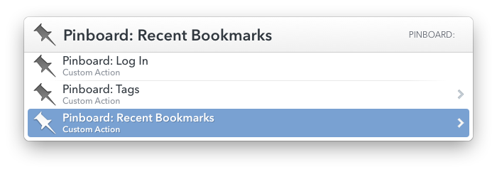

# Pinboard for LaunchBar

A suite of custom actions for [LaunchBar 6 (beta)](http://blog.obdev.at/post/announcing-launchbar-6-beta/) that provide access to [Pinboard](https://pinboard.in/u:gillibrand) bookmarks. 

# Installation

[Download the ZIP](https://github.com/gillibrand/launchbar-pinboard/archive/master.zip) and unzip. Each action is a `.lbaction` file that you can double-click to install. Only `Pinboard Log In.lbaction` is required.

# Actions

## Pinboard Log In

This action is *required* by all the other actions in order to access your Pinboard account. Prompts for and saves your Pinboard API token. 

Your API token (not password) is saved as plain-text in the Application Support directory for this action.

## Pinboard Recent

Lists your 25 most recent bookmarks. Tags are sorted from most-used to least.

## Pinboard Tags

Lists your Pinboard tags sorted from most-used to least. Selecting a tag lists all the bookmarks for that tag.

## Pinboard Search

Searches the titles, descriptions, and tags of all your bookmarks.

Search results can be up to five minutes out-of-date. This is done to improve performance if you have a large number of bookmarks. If you notice your results are out-of-date, you can try searching for `refresh` with this action and choosing the `Refresh your out-of-date bookmarks` action.

# Building

If you want edit or customize these actions for yourself, be aware that `Grunt` is used to append a shared script to each of the individual action scripts. See `shared.js` for more detail.

# Version History

#### 4/24/2014

- Initial release.